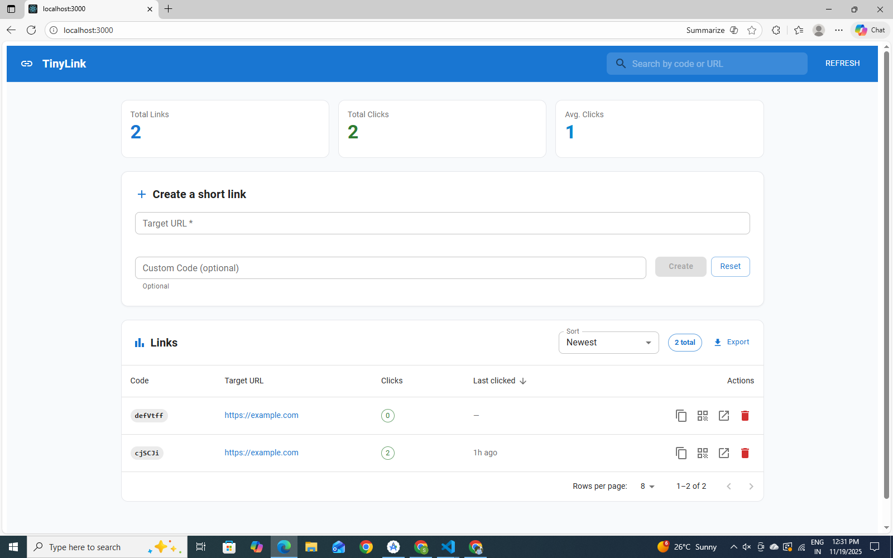
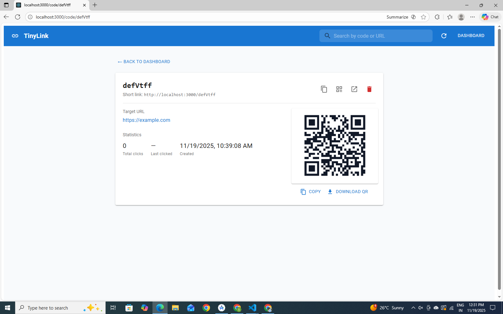

# shorten-url-web-app – URL Shortener (Node.js + Next.js + DynamoDB)

A production‑quality URL shortener built using **Next.js**, **Node.js API routes**, **AWS DynamoDB**, and deployed on **Vercel**.  
Includes full analytics, QR generation, mobile‑friendly UI, and MUI‑based modern dashboard.

---

## ✨ Features

- Shorten any long URL with auto-generated or custom codes  
- Full CRUD operations (Create, Read, Delete)  
- QR code generation & downloading  
- Real-time click analytics  
- Redirect handler `/[code]`  
- Fully responsive dashboard  
- Beautiful UI using **Material UI**  
- DynamoDB for persistent storage  
- Vercel-ready serverless deployment  
- CSV export, search, sorting, pagination  
- Per-link stats page

---

## 🛠️ Tech Stack

| Layer | Technology |
|------|------------|
| Frontend | **Next.js + React + MUI** |
| Backend | Next.js API Routes (**Node.js**) |
| Database | **AWS DynamoDB** |
| Hosting | **Vercel** |
| QR Generation | `qrcode` npm package |
| Styles | MUI Components |

---

## ⚙️ Project Setup

### 1️⃣ Install dependencies

```
npm install
```

---

## 🗄️ DynamoDB Table Structure

Create a table:

| Key | Type |
|-----|------|
| `code` | String (Partition Key) |

Additional attributes stored per item:

- `url`
- `clicks`
- `createdAt`
- `lastClickedAt`

---

## ▶️ Running Locally

Start dev server:

```
npm run dev
```

Visit:

```
http://localhost:3000
```

---

## 🚀 Deploying to Vercel

```
npm i -g vercel
vercel
```

Paste the same environment variables there.

---

## 📁 Project Structure

```
📦 tinylink
 ┣ 📂 pages
 │ ┣ 📂 api
 │ │ ┣ 📜 links/index.js
 │ │ ┗ 📜 links/[code].js
 │ ┣ 📜 code/[code].js  → Stats Page
 │ ┗ 📜 index.js        → Dashboard
 ┣ 📂 lib
 │ ┗ 📜 dynamo.js       → DynamoDB helper
 ┣ 📜 .env.local.example
 ┣ 📜 .gitignore
 ┗ 📜 README.md
```

---

## 📊 Stats Page Features

- Show total clicks  
- Show last click time  
- Show creation date  
- Full QR view modal  
- Download QR  
- Delete link  
- Open original URL  
- Copy short URL  

---

## 📸 Screenshots

## 📸 Dashboard Preview



## 📊 Stats Page




---

## 🙋 Author

G SAGAR REDDY
https://github.com/sagar13m

---

